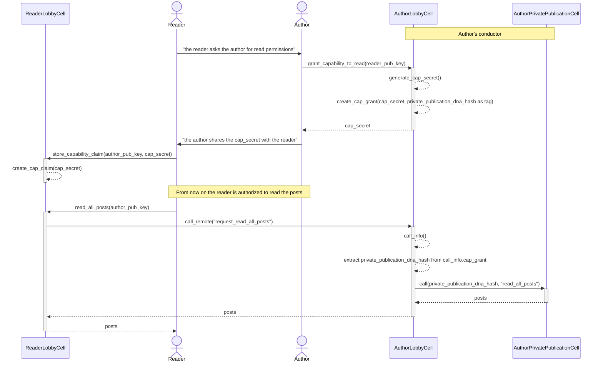

# Exercises

You are going to re-implement this private publication happ, one exercise at a time. Every exercise has a series of steps, and in each step there will be some missing feature in the DNA code that you'll have to implement, and then run the tests to confirm that your solution is correct.

These are the instructions for the first step, amenable to all the other steps:

1. Run `EXERCISE=1 STEP=1 npm test`.

- This is the error message you should see:

```
14:15:40 [Tryorama - Local Conductor] info: WARNING: running without local db encryption

14:15:40 [Tryorama - Local Conductor] info: WARNING: running without local db encryption

{
  type: 'error',
  data: {
    type: 'ribosome_error',
    data: "Attempted to call a zome function that doesn't exist: Zome: private_publication_lobby Fn grant_capability_to_read"
  }
}
npm ERR! Lifecycle script `test` failed with error: 
npm ERR! Error: command failed 
npm ERR!   in workspace: tests@0.0.0 
npm ERR!   at location: /home/guillem/projects/holochain/immersive/private-publication/tests 
```

2. Implement the missing function that that step requires (see step 1 in the "Exercise 1: Profiles zome" section of this document).
3. Run the tests again, until **all tests** pass again.
4. Move on to the next step, and run the new tests.

- Eg. for the second step, you should run `EXERCISE=1 STEP=2 npm test`.

5. When you are done with all the steps in an exercise, move to the next exercise (see step 1 in the "Exercise 2: Comments zome" of this document):

- Eg. for first step of the 2nd exercise, you should run `EXERCISE=2 STEP=1 npm test`.

## Private publication

The private publication app is really similar to the forum one from the first exercise, although with a couple of important architectural differences. 

The requirement for this app is that any agent can create their own private publication, for which they have complete read and write permissions. Let us call this agent the "author" of the publication.
After creating the publication, its author can grant read permissions for it to any other agent, the "reader". These permissions should be revokable, meaning that at any point in time the author of the publication can remove the read permissions from the reader.

Lastly, the author of a private publication can also grant write permissions to any agent, which we'll call the "editor" of the publication. This permission isn't be revokable.

### Architecture

In this setup, there are two DNAs:

- Lobby: everyone is able to join this DNA. This is where agents negotiate granting of capabilities to read the private publications.
- Private publication: this is a clonable DNA, which means that it's not instantiated at install time. Instead, any author can choose to create its own private publication DNA, and they do so by cloning the private publication DNA and setting their own public key in the properties as the DNA's progenitor (which means they are the administrator for that DNA).  Other agents can then be invited to this cloned DNA if the progenitor wants, so that they can also become authors of the publication.

## Exercise 1: Capability Tokens

The posts zome for creating and managing the posts is already implemented. In this exercise we are going to create the zome for the lobby DNA, with this functionality:

- Grant permissions to read the private publication to an agent in the lobby.

This is the flow that we've designed for granting read permissions:

You can visualize this diagram in its [github page](https://github.com/holochain-immersive/private-publication/blob/main/EXERCISES.md#exercise-1-capability-tokens).



Solve the next steps in the `private_publication_lobby` coordinator zome, in `dnas/lobby/coordinator_zomes/private_publication_lobby/src/lib.rs`.

1. Create a `GrantCapabilityToReadInput` struct with two fields: `reader` of type `AgentPubKey` and `private_publication_dna_hash` of type `DnaHash`.

- Annotate this struct with `#[derive(Serialize, Deserialize, Debug)]`.
- Create a function `grant_capability_to_read` that receives a `GrantCapabilityToReadInput` struct and: 
  - Generates a capability secret with `random_bytes()`.
  - Converts the `private_publication_dna_hash` to a `String` using `DnaHashB64::from(input.private_publication_dna_hash).to_string()`.
  - Create an assigned capability grant to call `request_read_private_publication_posts` to the reader, using the stringified `private_publication_dna_hash` as the tag.
  - Returns the `CapSecret` that was generated.

2. Create a `StoreCapClaimInput` struct with two fields: `author` of type `AgentPubKey`, and `cap_secret` of type `CapSecret`.

- Annotate this struct with `#[derive(Serialize, Deserialize, Debug)]`.
- Create a function `store_capability_claim` that receives an `StoreCapClaimInput` struct and stores a capability claim with the given secret and author.

3. Create a function `read_posts_for_author` that receives the `AgentPubKey` of the author of the private publication we want to read the posts from, and returns a `Vec<Record>`:

- Query the source chain to get the capability claim.
- Call remote to the given author's `request_read_private_publication_posts` and the capability secret found in the capability claim.
  - Make sure to return the actual error message from the `ZomeCallResponse` if the `call_remote` fails.
- Return the result.

4. Create a function `request_read_private_publication_posts` with no inputs that:

- Calls [call_info()](https://docs.rs/hdk/latest/hdk/info/fn.call_info.html) and extracts the capability grant that was used to call this function.
- Converts the tag from the capability grant to a `DnaHash`, using 
```rust
let private_publication_dna_hash = DnaHash::from(
    DnaHashB64::from_b64_str(zome_call_cap_grant.tag.as_str()).or(Err(wasm_error!(
        WasmErrorInner::Guest(String::from("Bad cap_grant tag"))
    )))?,
);
```
- Constructs the private publication cell id with `CellId::new(private_publication_dna_hash, agent_info()?.agent_latest_pubkey)`
- Makes a [bridge call](https://docs.rs/hdk/latest/hdk/p2p/fn.call.html) to the private publication cell, zome name `posts`, and function name `get_all_posts`, and just returns its contents.

## Exercise 2: Validation Rules

We are going to implement these new functionalities:

- As the progenitor of the private publication, I should be able to invite other agents into the private publication DNA.
- As the progenitor of the private publication, only I should be able to assign the editor role to agents in the private publication DNA.
- Only agents with the editor role should be able to create posts in the private publication DNA.
- Only the creator of a post should be able to update it.

Go into `crates/membrane_proof/src/lib.rs`. 

- Notice the `PrivatePublicationMembraneProof` struct. This is the entry that each author is going to create in the lobby, and is going to share with the editor so that they can join the author's private publication dna.
- Notice also that this struct is located in a shared crate, which both the `private_publication_lobby` and `private_publication` zomes are going to depend upon.

Go into `dnas/lobby/coordinator_zomes/private_publication_lobby/src/lib.rs`:

1. Create a  `create_membrane_proof_for` zome function that receives a `PrivatePublicationMembraneProof` and returns no output. This function will be executed by the progenitor of the app.
   - Create a `PrivatePublicationMembraneProof` entry with the private publication DNA hash and the recipient for that membrane. 
   - Create a link from the agent public key of the recipient to the newly created action.

2. Create a `get_my_membrane_proof` zome function that doesn't receive any parameters, and returns an `Option<Record>`.
   - Get the links from your public key of type `LinkTypes::AgentToMembraneProof`.
   - If there is some link, return the record that the target is pointing to.

Go into `dnas/lobby/integrity_zomes/private_publication/src/properties.rs`:

3. Add a `Properties` struct, with only a `progenitor` field of type `AgentPubKeyB64`.

- Annotate this struct with `#[derive(Serialize, Deserialize, Debug, SerializedBytes)]`.
- Create an extern function `progenitor` that doesn't have any input parameters and that returns the `AgentPubKey` for the progenitor of this DNA.
  - Get the serialized properties with `dna_info()?.properties`.
  - Transform that serialized properties type into our `Properties` struct.

Now go into `dnas/private_publication/integrity_zomes/private_publication/src/validation.rs`. There you can see boilerplate that allows for the genesis self-check and for different validations for the two kinds of entries present in that DNA.

Go into `dnas/private_publication/integrity_zomes/private_publication/src/membrane.rs`. 

4. Implement the membrane proof check to avoid unwanted agents coming into the DHT:
    - If the agent we are validating for is the progenitor, then the membrane proof check is valid.
    - If not, serialize the membrane proof into a `Record`.
    - Check that the author of the action in the record is the progenitor.
    - Check that the signature in the Record is valid for the `record.action_hashed().content()` of the record.
    - Deserialize the record's entry into a `PrivatePublicationMembraneProof`.
    - Check that the dna hash inside the `PrivatePublicationMembraneProof` is equal to the dna hash of the `private_publication` DNA.
    - Check that the agent we are checking the membrane for is the agent that is inside the `PrivatePublicationMembraneProof`.

Go into `dnas/private_publication/coordinator_zomes/roles/src/lib.rs`. 

5. Create an `assign_editor_role` function that takes an `AgentPubKey`, and creates a `PublicationRole` entry with role equal to `String::from("editor")`.

Go into `dnas/private_publication/integrity_zomes/private_publication/src/publication_role.rs`. 

6. Implement the `validate_create_publication_role`, only allowing the progenitor to create the `PublicationRole` entry.

Go into `dnas/private_publication/integrity_zomes/private_publication/src/post.rs`. 

7. Implement the `validate_create_post` function so that only agents for which a `PublicationRole` with role "editor" has been created can create posts.

8. Implement the `validate_update_post` function so that only the original author of the post can modify their posts.

